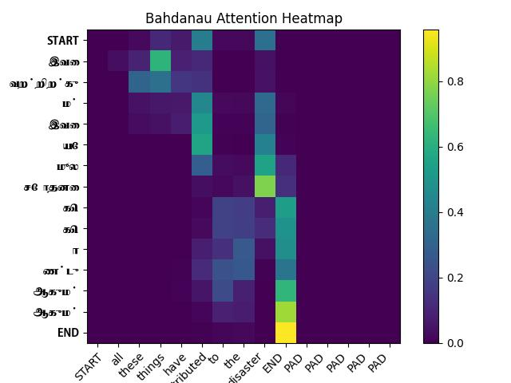
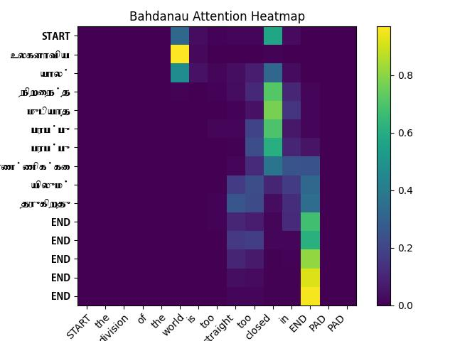
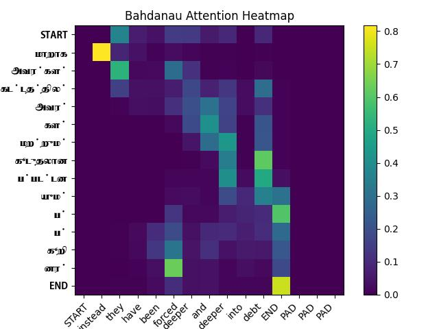

# NMT_repetitions
A study of the cause of repetitions in NMT involving morphologically rich languages. For now, the study is restricted to English - Tamil Machine Translation. 

### Some initial results through attention maps:

